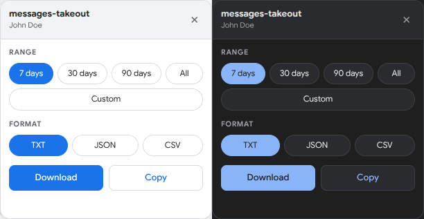

# messages-takeout

Export a **Google Messages** conversation to plain text or JSON, straight from
the browser DevTools console. No extension, no dependencies, no account access.

Google Takeout will hand you your Mail, your Photos and your Location History —
but not the RCS threads sitting in Google Messages. This is the missing takeout.

> **Credit:** this is a rewrite of
> [`exportConversation.js` by prooma](https://codeberg.org/prooma/google-messages-web-export)
> (MIT). The original stopped matching the Google Messages DOM; see
> [What changed](#what-changed).



---

## Usage

### The menu

1. Open <https://messages.google.com/web> and select a conversation.
2. Open DevTools (`F12`) and switch to the **Console** tab.
3. Paste in the contents of [`exportConversation.js`](exportConversation.js)
   and press Enter.

The panel above appears in the corner. Pick a range, pick a format, then
**Download** or **Copy**. Drag it by its header if it covers something; close it
with **✕** and reopen it with `showExportMenu()`.

### As a bookmarklet

To skip DevTools entirely, save it as a bookmark once and click it on any
conversation:

1. Copy the single line from [`bookmark.js`](bookmark.js).
2. Create a new bookmark (Chrome: `Ctrl+Shift+O` → ⋮ → *Add new bookmark*).
3. Name it anything; paste the line into the **URL** field.
4. Open a conversation and click the bookmark — the menu opens.

Clicking it again is safe: it replaces the menu rather than stacking copies.

### From the console

The functions stay available for scripting:

```js
await exportConversation();                        // last 7 days, as text
copy(await exportConversation());                  // ...onto the clipboard
await exportConversation({ returnJson: true });    // structured objects
await downloadConversation();                      // save conversation.txt
await downloadConversation({ format: "json" });    // save conversation.json
await downloadConversation({ format: "csv" });     // save conversation.csv
```

The script is **async** — `exportConversation()` without `await` gives you a
Promise, not messages.

### Picking a date range

Google Messages keeps only the newest ~25 messages in the page and pages the
rest in on demand, at roughly 1–4 seconds per batch. A multi-year thread is a
long wait, so the default window is the **last 7 days**:

```js
await exportConversation({ days: 30 });            // last 30 days
await exportConversation({ since: "2026-01-01" }); // from a fixed date
await exportConversation({ since: "2026-01-01", until: "2026-02-01" });
await exportConversation({ all: true });           // the entire thread
```

Paging stops as soon as it reaches past your cutoff, so a narrow window is fast.

---

## Options

| Option | Default | Meaning |
| --- | --- | --- |
| `days` | `7` | How far back to export |
| `since` | `null` | `Date`, `"YYYY-MM-DD"` or epoch ms; overrides `days` |
| `until` | `null` | Optional newer bound, same formats |
| `all` | `false` | Ignore the window and walk the whole thread |
| `returnJson` | `false` | Return message objects instead of formatted text |
| `meLabel` | `"Me"` | Name to use for your own messages |
| `maxLoadClicks` | `500` | Safety cap on "Load more messages" clicks |
| `loadWaitMs` | `25000` | How long to wait for one batch to arrive |
| `loadRetries` | `3` | Consecutive empty batches before stopping |
| `includeLinkPreviews` | `false` | Keep link-preview card text in the message body |
| `includeReactions` | `true` | Append `(reactions: ...)` to messages that have any |
| `onProgress` | `null` | `fn({ loaded, clicks, oldest })` after each batch |

---

## Output

### Text

```
[Tuesday, January 20, 2026, 12:05 PM] Me:
Hello!

[Tuesday, January 20, 2026, 12:06 PM] John Doe:
Hi!
(reactions: ❤️ Me)
```

### CSV

Columns are `iso, date, time, sender, direction, text, reactions`. Fields are
quoted per RFC 4180, so messages containing commas or line breaks stay in one
record, and the file carries a UTF-8 BOM so Excel renders emoji correctly.

```csv
iso,date,time,sender,direction,text,reactions
2026-01-20T17:05:00.000Z,"Tuesday, January 20, 2026",12:05 PM,Me,sent,Hello!,
2026-01-20T17:06:00.000Z,"Tuesday, January 20, 2026",12:06 PM,John Doe,received,Hi!,❤️ Me
```

### JSON

```json
[
  {
    "id": "MxAAAAAAAAAAAAAAAAAAAAAA",
    "outgoing": true,
    "name": "Me",
    "date": "Tuesday, January 20, 2026",
    "time": "12:05 PM",
    "iso": "2026-01-20T17:05:00.000Z",
    "text": "Hello!",
    "reactions": []
  },
  {
    "id": "MxBBBBBBBBBBBBBBBBBBBBBB",
    "outgoing": false,
    "name": "John Doe",
    "date": "Tuesday, January 20, 2026",
    "time": "12:06 PM",
    "iso": "2026-01-20T17:06:00.000Z",
    "text": "Hi!",
    "reactions": [{ "by": "Me", "type": "love", "emoji": "❤️" }]
  }
]
```

---

## What changed

The original ran without throwing but returned a truncated export with broken
dates. Five distinct problems, all fixed here:

| # | Problem | Cause |
| --- | --- | --- |
| 1 | Only ~25 messages exported | The DOM was read once. Google Messages pages older messages in behind a "Load more messages" button. |
| 2 | Dates wrong or missing | Dates came from the grey separators, which are relative and year-less (`"Sunday"`). Today's separator is a bare time (`" 9:09 AM "`), so splitting on `" · "` filed a *time* under `date`. |
| 3 | Multi-line messages ran together | Text was read via `innerText` on a **detached clone**, which has no layout — so `innerText` degrades to `textContent` and every `<br>` vanishes. |
| 4 | Images silently dropped | The script looked for `mws-image`; the real tag is `mws-image-message-part`. |
| 5 | Group threads mislabelled senders | One name was taken from the header and applied to every incoming message. |

Timestamps now come from each message part's `aria-label`
(`"Sent on August 16, 2026 at 4:43 PM"`), which is absolute and carries the
year. Sender names come from the same place, so group threads name each person.
Attachments become `[Image]`, `[Video: clip.mp4]` and so on, with unknown part
types labelled from their tag rather than skipped.

---

## Notes and limits

- **English UI assumed for timestamps.** The `aria-label` text is localised. On
  a translated UI the script warns and falls back to the date separators;
  reaction emoji still work, since those are read from the DOM, not parsed.
- **Media is not downloaded.** Google Messages serves attachments from `blob:`
  URLs that die with the page, so they are exported as placeholders.
- **Only synced history is reachable.** The web client holds what your phone has
  synced to it, which is not necessarily the whole thread.
- **It clicks one button.** To page the thread in, the script clicks the app's
  own "Load more messages". Otherwise it only reads the page.
- **The menu avoids `innerHTML`.** messages.google.com enforces Trusted Types,
  so assigning `innerHTML` throws `This document requires 'TrustedHTML'`. The UI
  is built with `createElement`/`textContent` in a shadow root with a
  constructable stylesheet, which the policy allows.
- Tested against Google Messages web as of August 2026. It reads Angular
  component tags (`mws-message-wrapper` and friends), so a Google redesign can
  break it — the failure mode to watch for is a suspiciously short export.

---

## Disclaimer

Not affiliated with, endorsed by, or sponsored by Google. Google Messages,
Google Takeout and related names are trademarks of Google LLC. This is an
independent tool that reads a page you are already logged in to, in your own
browser.

## License

MIT — see [LICENSE](LICENSE). Original work © prooma, modifications © s0meguy1.
